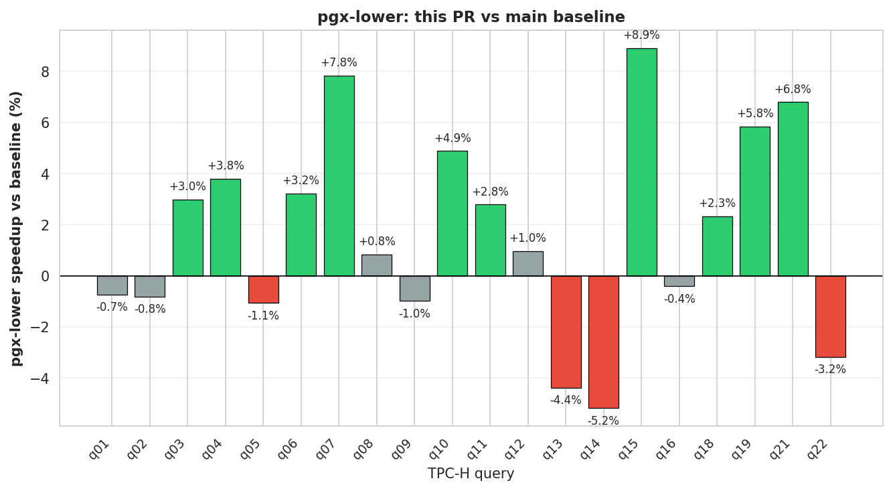

## Benchmark report

**Geometric-mean speedup vs baseline: +1.8% 🟢**

- Baseline: `814150e` (run 2026-04-18T23:58:52.803908)
- Current:  `unknown` (run 2026-04-18T23:41:06.842601)
- Scale factor: 0.01

| Query | Baseline (ms) | Current (ms) | Δ |
|-------|--------------:|-------------:|--:|
| q01 | 317.7 | 320.1 | -0.7% ⚪ |
| q02 | 567.8 | 572.4 | -0.8% ⚪ |
| q03 | 428.1 | 415.3 | +3.0% 🟢 |
| q04 | 198.3 | 190.8 | +3.8% 🟢 |
| q05 | 316.0 | 319.3 | -1.1% 🔴 |
| q06 | 116.3 | 112.5 | +3.2% 🟢 |
| q07 | 357.4 | 329.4 | +7.8% 🟢 |
| q08 | 411.7 | 408.3 | +0.8% ⚪ |
| q09 | 401.8 | 405.7 | -1.0% ⚪ |
| q10 | 348.0 | 331.0 | +4.9% 🟢 |
| q11 | 271.3 | 263.7 | +2.8% 🟢 |
| q12 | 200.9 | 199.0 | +1.0% ⚪ |
| q13 | 160.0 | 167.0 | -4.4% 🔴 |
| q14 | 152.8 | 160.7 | -5.2% 🔴 |
| q15 | 236.3 | 215.3 | +8.9% 🟢 |
| q16 | 239.3 | 240.3 | -0.4% ⚪ |
| q18 | 464.1 | 453.3 | +2.3% 🟢 |
| q19 | 270.0 | 254.3 | +5.8% 🟢 |
| q21 | 519.3 | 484.0 | +6.8% 🟢 |
| q22 | 223.0 | 230.0 | -3.2% 🔴 |
